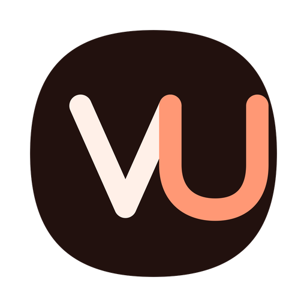
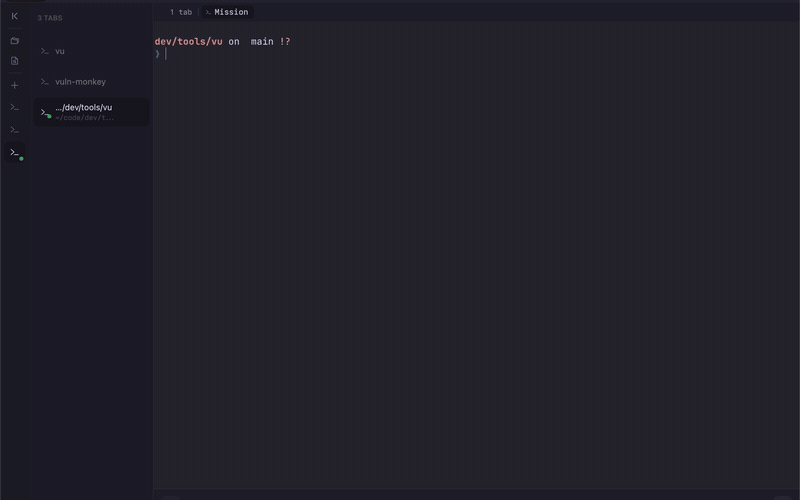

<p align="center">
  
</p>

<h1 align="center">vu</h1>

<p align="center"><strong>A better customizable terminal.</strong></p>

<p align="center">
  Native, GPU-accelerated, and built to feel like yours.
</p>

<p align="center">
  <a href="https://github.com/cdbkk/vu/actions/workflows/ci-portable.yml"></a>
  <a href="LICENSE"></a>
  
  
  
</p>

<p align="center">
  <a href="docs/media/vu-demo.mp4">
    
  </a>
</p>

<p align="center"><sub>Click the demo for the full-quality video.</sub></p>

## What it is

`vu` is a native terminal for people who want it to look and behave like theirs.
It keeps the speed of a real terminal and puts the things you tune every day in
a settings panel that applies live. No config archaeology.

### Make it yours

- built-in themes with live previews, plus Ghostty theme import and export
- a full ANSI palette editor with a color picker per slot
- separate terminal and interface fonts
- opacity, blur, background images, tab placement, pane chrome, cursor style, and icon scale
- editable shortcuts with conflict detection

### Work in it

- native GPU rendering: Metal on macOS, D3D11 and DirectWrite on Windows
- tabs, split panes, pane zoom, drag to rearrange, and multiple surfaces per pane
- an input bar that runs a command in one pane or every selected pane, with history and path completion
- a files sidebar and a command palette
- saved workspaces: sessions restore on launch, and `.vu/workspace.toml` stores a project layout
- `ssh`, `tmux`, shells, editors, and TUIs behave as they do in any good terminal
- `vu-cli`, a local JSON-RPC control plane for scripts and tests that can list tabs, read panes, and send keys

## Status

`vu` is in active beta development.

| Platform | Status | Backend |
| --- | --- | --- |
| macOS | Beta, primary target | libghostty + Metal |
| Windows | Beta | ConPTY + libghostty-vt + D3D11/DirectWrite |
| Linux | Preview | Unix PTY + libghostty-vt + GPUI |

## Install

Download the unsigned macOS beta for Apple silicon (M1 or newer):

- [Download the DMG](https://github.com/cdbkk/vu/releases/download/v0.4.0-beta.1/vu-Beta-0.4.0-beta.1-macos-arm64.dmg)

> **Unsigned beta:** Apple has not notarized this build. After trying to open
> it, go to **System Settings → Privacy & Security** and click **Open Anyway**.

Open the DMG, then drag **vu Beta** to Applications. The checksum and ZIP build
are available on the [release page](https://github.com/cdbkk/vu/releases/tag/v0.4.0-beta.1).

## Build from source

The repository pins its toolchain with [mise](https://mise.jdx.dev/):

```sh
git clone https://github.com/cdbkk/vu.git
cd vu
mise install
mise exec -- cargo build --release -p vu
```

On macOS 26, build the app bundle through the included Zig SDK shim:

```sh
VU_ZIG_BIN="$PWD/scripts/zig-macos26-shim.sh" \
VU_ZIG_REAL="$(mise where zig)/bin/zig" \
mise exec -- just channel=dev macos-bundle

open "dist/macos/dev/arm64/vu Dev.app"
```

See the [install guide](docs/install.md) for platform prerequisites and
[HACKING.md](HACKING.md) for contributor builds, tests, and release tooling.

## Start here

- [Quick controls](docs/quick-controls.md)
- [Appearance and settings](docs/settings.md)
- [Terminal workflows](docs/terminal-workflows.md)
- [CLI and control plane](docs/cli.md)
- [Architecture](DESIGN.md)
- [Release notes](CHANGELOG.md)

## Built on excellent work

`vu` builds on [Ghostty](https://github.com/ghostty-org/ghostty),
[GPUI](https://github.com/zed-industries/zed/tree/main/crates/gpui),
[gpui-component](https://github.com/longbridge/gpui-component),
[Phosphor Icons](https://phosphoricons.com/), and
[Flexoki](https://stephango.com/flexoki).

## License

[MIT](LICENSE)
