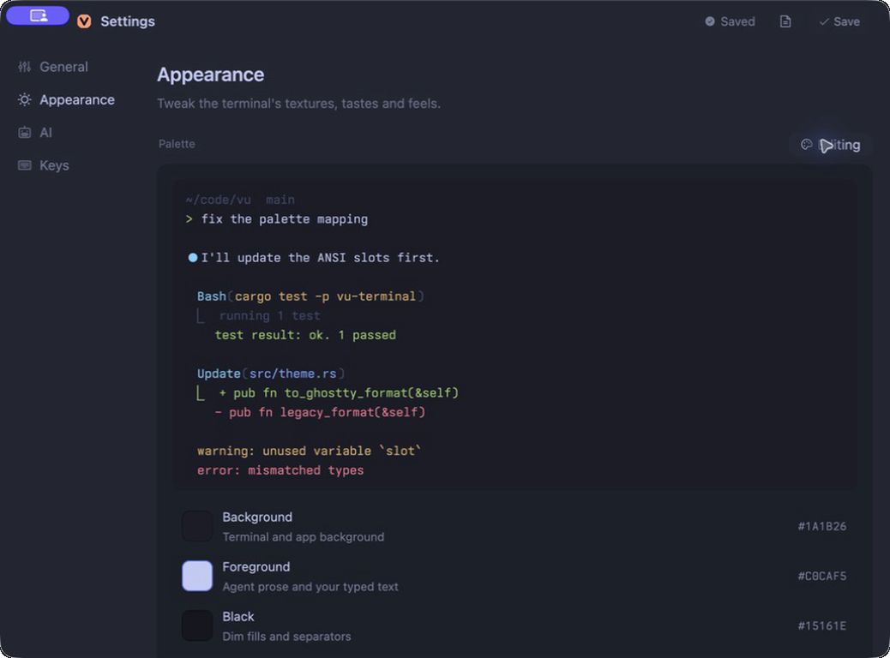
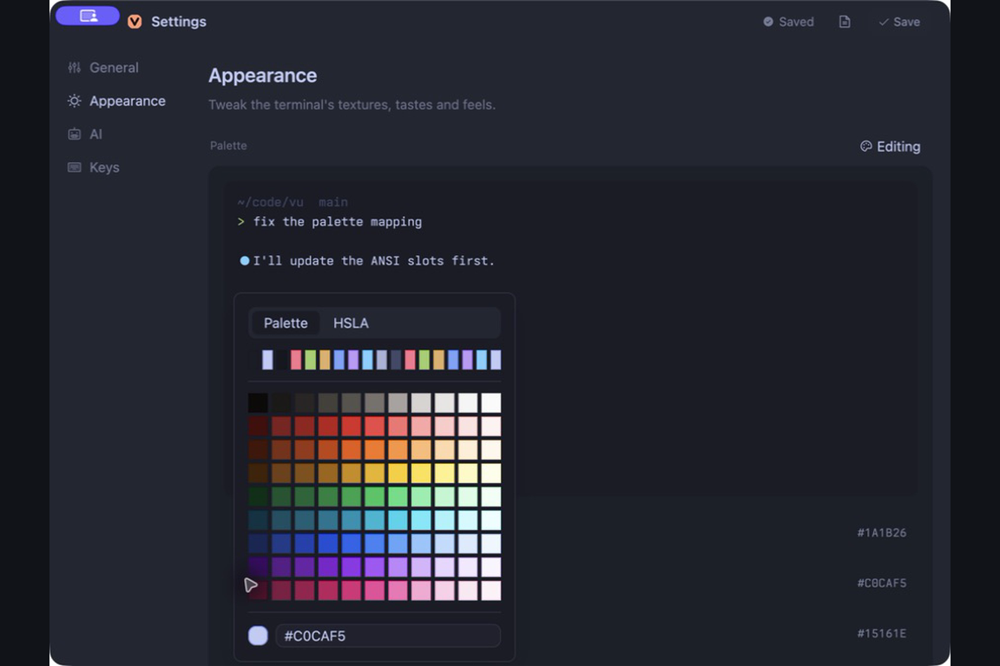

# Customization

Everything you can change in vu, where it lives, and what it does. The
Settings window covers most of it. The rest is a short edit to `config.toml`
or a theme file.



## Where settings live

vu keeps one TOML file per user.

| OS | Config file |
| --- | --- |
| macOS | `~/Library/Application Support/vu/config.toml` |
| Linux | `~/.config/vu/config.toml`, or `$XDG_CONFIG_HOME/vu/config.toml` |
| Windows | `%APPDATA%\vu-terminal\config.toml` |

Set `VU_CONFIG_PATH` to an absolute path to use a different file. The value is
used as written, so `~` is not expanded.

A missing file means defaults. A missing key means that key's default. A file
that fails to parse also means defaults, so a typo does not stop the app from
starting, it just drops your settings until the file is fixed.

Settings > General has an **Open config.toml** button that opens the file in
your editor and creates it if needed. vu does not watch the file. Edits on disk
apply the next time the config loads, which in practice means the next launch
or the next new window. When the Settings window saves, it rewrites the whole
file from its own state, so comments and unknown keys in a hand edited file do
not survive a Save.

## The Settings window

Open it with **Cmd ,** on macOS or **Ctrl ,** on Windows and Linux. It has three
tabs.

**General** holds startup and app behavior. The new tab directory, whether
terminal text is restored after a restart, the update checker, and HTTP proxy
fields.

**Appearance** holds the theme, the two fonts, the terminal tweaks, and four
cards named Transparency, Tabs & Top Bar, Background Image, and Panes.

**Keys** lists every rebindable shortcut, the fixed shortcuts vu reserves, and
the optional global Summon / Hide shortcut.

Most Appearance controls preview on the window that opened Settings as you
move them. Text fields such as font size and image path apply when you press
**Save**. Save also writes the file.

## Themes

Pick a theme at the top of Appearance. The change previews at once and is
written to `terminal.theme` on Save. The terminal palette also drives the
interface colors, so chrome, sidebar, and tabs follow the theme.

### Built in

| Shown as | `terminal.theme` |
| --- | --- |
| Flexoki Dark | `flexoki-dark` |
| Flexoki Light | `flexoki-light` |
| Catppuccin | `catppuccin-mocha` |
| Tokyo Night | `tokyonight` |
| Dracula | `dracula` |
| Nord | `nord` |
| Rose Pine | `rose-pine` |
| Gruvbox Dark | `gruvbox-dark` |
| Solarized Dark | `solarized-dark` |
| Solarized Light | `solarized-light` |
| One Half Dark | `one-half-dark` |
| Kanagawa Wave | `kanagawa-wave` |
| Everforest Dark | `everforest-dark` |
| Everforest Light | `everforest-light` |
| Paper Light | `paper-light` |

Names are matched without case. Short forms such as `flexoki`, `catppuccin`,
`gruvbox`, `solarized`, `kanagawa`, and `everforest` resolve to the dark
variant. The default is `flexoki-light`.

### Import a Ghostty theme

vu reads the Ghostty theme text format, which is what most theme sites and
repositories publish.

1. In Appearance, click **Import Theme**. **Browse Themes** opens a gallery of
   Ghostty themes in your browser.
2. Copy the theme text, give it a name in the **Theme name** field, and click
   **Load from Clipboard**.
3. The palette editor opens with the imported colors and the window previews
   them. Adjust anything, then **Save & Apply**.
4. Press **Save** in Settings so `terminal.theme` points at the new theme on
   the next launch.

A blank name saves the theme as `custom`.

### Edit the palette



**Customize** opens the editor for whichever theme is selected. It has 18
slots, background, foreground, and ANSI 0 through 15, each with a color picker.
Every change previews on the workspace behind the Settings window.

**Copy** puts the working palette on the clipboard in Ghostty format, which is
also how you export a theme to share.

**Save & Apply** writes the palette as a user theme and switches to it. The
editor suggests the current name with `-custom` added, because built in names
are reserved and cannot be overwritten. **Done** closes the editor and, if you
did not save, restores the previous theme.

### Theme files

User themes are plain text files, one per theme, with no extension required.

| OS | Theme directory |
| --- | --- |
| macOS | `~/Library/Application Support/vu/themes/` |
| Linux | `~/.config/vu/themes/` |
| Windows | `%APPDATA%\vu-terminal\themes\` |

The file name is the theme identifier. Spaces become `-` and the name is
lowercased, so a file named `My Theme` is selected with
`theme = "my-theme"`. A user theme with the same name as a built in one is
ignored, the built in wins.

A complete file looks like this. It is the Flexoki Light palette.

```text
background = #FFFCF0
foreground = #100F0F
palette = 0=#100F0F
palette = 1=#AF3029
palette = 2=#66800B
palette = 3=#AD8A01
palette = 4=#205EA6
palette = 5=#5E409D
palette = 6=#24837B
palette = 7=#CECDC3
palette = 8=#878580
palette = 9=#D14D41
palette = 10=#879A39
palette = 11=#D0A215
palette = 12=#4385BE
palette = 13=#CE5D97
palette = 14=#3AA99F
palette = 15=#FFFCF0
```

Rules the parser applies. Colors are six hex digits with an optional `#` and no
quotes. `background` and `foreground` are required. At least eight `palette`
lines are required, and slots 0 to 15 that you leave out stay black. Blank
lines and lines starting with `#` are skipped. Any other `key = value` line is
ignored, and a line with no `=` fails the whole file.

## Fonts

vu uses two fonts. The terminal font renders the grid. The interface font
renders tabs, the sidebar, the input bar, and Settings.

```toml
[terminal]
font_family = "Ioskeley Mono"
font_size = 14.0

[appearance]
ui_font_family = ".SystemUIFont"
ui_font_size = 16.0
```

The terminal font must be a real installed family. Virtual names such as
`.SystemUIFont` are only valid for the interface font. If the terminal family
is empty or starts with a dot, vu falls back to the bundled Ioskeley Mono. The
interface size is clamped to 12 through 24. Monospace text in the interface
uses a size three points smaller than the interface size.

Both pickers in Settings list the families installed on the machine and keep
whatever is written in the config even if it is not installed, so a font you
set on one machine still shows up as selected on another.

On Windows, an unavailable family falls through Cascadia Mono, Cascadia Code,
Consolas, Lucida Console, Courier New, and Segoe UI in that order. Font changes
on Windows apply to new terminals rather than ones already open.

### Terminal tweaks

These live under `[terminal.tweaks]` and in the Appearance tab.

| Key | Default | Range | What it does |
| --- | --- | --- | --- |
| `line_height_percent` | `0.0` | -20 to 100 | Adds or removes height from each cell |
| `letter_spacing_percent` | `0.0` | -20 to 100 | Adds or removes width from each cell |
| `ligatures` | `true` | | Font ligatures on or off |
| `font_thicken` | `false` | | Slightly heavier glyph rendering |
| `cursor_blink` | `true` | | Cursor blink |
| `bold_is_bright` | `false` | | Bold text uses the bright ANSI colors |
| `minimum_contrast` | `1.0` | 1 to 21 | Forces a minimum contrast ratio between text and background |
| `unfocused_split_opacity` | `1.0` | 0.15 to 1 | Dims the terminal in splits that do not have focus |
| `window_padding_x` | `0.0` | 0 to 64 | Padding inside the terminal, left and right |
| `window_padding_y` | `0.0` | 0 to 64 | Padding inside the terminal, top and bottom |
| `mouse_hide_while_typing` | `false` | | Hides the pointer while you type |
| `selection_background` | unset | hex color | Overrides the selection fill |
| `selection_foreground` | unset | hex color | Overrides the selected text color |

The **Window Padding** slider in Settings sets both axes to the same value.
Different values for X and Y are a file edit. The two selection colors are file
only.

Cursor shape is `terminal.cursor_style` with `bar`, `block`, `underline`, or
`block_hollow`.

Windows ignores the tweaks except through the palette and opacity paths, and
Linux ignores `font_thicken`, `minimum_contrast`, `unfocused_split_opacity`,
and `mouse_hide_while_typing`. See the platform table at the end.

## Transparency and blur

```toml
[appearance]
terminal_opacity = 0.80
terminal_blur = true
ui_opacity = 0.90
```

`terminal_opacity` runs from 0.25 to 1 and `ui_opacity` from 0.35 to 1. The
slider is not linear. Most of the visible range is in the top third, so 0.8
still reads as a solid terminal and the lower values are where the desktop
starts to show through. Blur asks the OS to blur what is behind the window.

macOS supports all three. Windows uses Acrylic for blur and falls back to Mica,
then to a solid fill. Linux has no blur, and a terminal in a full screen TUI
is drawn opaque so that the alternate screen stays readable. Some pane chrome is
drawn solid regardless of `ui_opacity`.

## Background image

macOS only. The image is drawn behind each terminal, under the terminal
opacity.

```toml
[appearance]
background_image = "/Users/you/Pictures/wallpaper.png"
background_image_opacity = 0.55
background_image_position = "center"
background_image_fit = "contain"
background_image_repeat = false
```

In Settings, the Background Image card has a **Browse…** button and the same
controls. Use an absolute path. Positions are `top-left`, `top-center`,
`top-right`, `center-left`, `center`, `center-right`, `bottom-left`,
`bottom-center`, and `bottom-right`. Fit is `contain`, `cover`, `stretch`, or
`none`. Remove the `background_image` line to turn the image off. vu does not
check the file exists or that it is an image, so a wrong path shows nothing
rather than an error.

## Tabs and top bar

`tabs_orientation` puts workspace tabs in a top strip (`horizontal`) or in the
left sidebar (`vertical`, the default). The Tabs & Top Bar card in Appearance
switches this and holds the rest.

Each tab can carry an accent color. The tab's context menu offers red, orange,
yellow, green, teal, blue, purple, pink, or none. Accents are saved with the
session, not in `config.toml`. Two keys control how strong an accent reads when
the tab is not active.

| Key | Default | Range | What it does |
| --- | --- | --- | --- |
| `tab_accent_inactive_alpha` | `0.15` | 0.05 to 1 | Accent opacity on inactive tabs |
| `tab_accent_inactive_hover_alpha` | `0.22` | 0.05 to 1 | Accent opacity on a hovered inactive tab, never below the value above |
| `tab_inactive_opacity` | `0.35` | 0 to 1 | Fill opacity of inactive tabs that have no accent |
| `tab_close_size` | `13.0` | 8 to 24 | Close icon size in pixels |

Five more keys override the strip colors outright, for people who want the
tab strip to match something other than the theme. They apply to the
horizontal strip only. Each has a picker in the Tabs & Top Bar card and a
**Reset** that removes the override and shows `theme` again.

| Key | Settings label | What it paints |
| --- | --- | --- |
| `tab_active_background` | Active Tab Color | Fill of the active tab |
| `tab_active_border` | Active Tab Border | Outline of the active tab |
| `tab_inactive_background` | Inactive Tab Color | Fill of inactive tabs |
| `tab_inactive_border` | Inactive Tab Border | Outline of inactive tabs |
| `tab_inactive_hover_background` | Inactive Tab Hover | Fill of an inactive tab under the pointer |

Values are six digit hex, with or without `#`. Alpha from the picker is
dropped, the colors are solid. A background override beats both the theme and
the tab's accent. Without overrides, the active tab has no outline and inactive
tabs get a faint white one.

## Panes and chrome

```toml
[appearance]
hide_pane_title_bar = false
icon_scale = 1.0
chrome_surface_strength = 1.0
chrome_border_strength = 1.0
```

`hide_pane_title_bar` removes the title bar above each split pane. Its toggle
saves on its own, without pressing Save. `icon_scale` sizes sidebar and tab
icons from 0.75 to 2.5 without touching text. The two strength values shape
the chrome that vu derives from the theme. Surface strength (0 to 4) is how far
sidebar, tab, and card fills sit from the terminal background. Border strength
(0 to 4) is how visible dividers and outlines are. At 0 the chrome flattens
into the terminal color, at higher values it separates.

## Shortcuts

Shortcuts are named keys under `[keybindings]`, one per action. The Keys tab
shows the same list. Click a shortcut, press the new combination, and Save.
Escape cancels a recording.

```toml
[keybindings]
new_tab = "secondary-t"
split_right = "secondary-d"
close_tab = ""
```

Modifiers are `ctrl`, `alt`, `shift`, `fn`, and `secondary`, joined with `-`.
`secondary` is Command on macOS and Control on Windows and Linux, which is why
one config file can travel between platforms. `alt` is Option on macOS. An
empty string removes the binding.

| Key | macOS | Windows and Linux | Action |
| --- | --- | --- | --- |
| `command_palette` | `secondary-shift-p` | `secondary-shift-p` | Command palette |
| `new_window` | `secondary-n` | `ctrl-shift-n` | New window |
| `new_tab` | `secondary-t` | `ctrl-shift-t` | New tab |
| `close_tab` | `secondary-w` | `ctrl-shift-w` | Close tab |
| `next_tab` | `ctrl-tab` | `ctrl-tab` | Next tab |
| `previous_tab` | `ctrl-shift-tab` | `ctrl-shift-tab` | Previous tab |
| `split_right` | `secondary-d` | `alt-d` | Split pane right |
| `split_down` | `secondary-shift-d` | `alt-shift-d` | Split pane down |
| `close_pane` | `secondary-alt-w` | `alt-shift-w` | Close pane |
| `toggle_pane_zoom` | `secondary-shift-enter` | `alt-shift-enter` | Zoom the focused pane |
| `focus_next_pane` | `alt-tab` | `ctrl-alt-tab` | Focus next pane |
| `focus_previous_pane` | `alt-shift-tab` | `ctrl-alt-shift-tab` | Focus previous pane |
| `new_surface` | `secondary-alt-t` | `alt-shift-t` | New surface in the pane |
| `new_surface_split_right` | `secondary-alt-d` | `alt-shift-right` | New surface, split right |
| `new_surface_split_down` | `secondary-alt-shift-d` | `alt-shift-down` | New surface, split down |
| `next_surface` | `secondary-ctrl-]` | `alt-shift-]` | Next surface |
| `previous_surface` | `secondary-ctrl-[` | `alt-shift-[` | Previous surface |
| `rename_surface` | `secondary-alt-r` | `alt-shift-r` | Rename surface |
| `close_surface` | `secondary-alt-shift-w` | `alt-shift-x` | Close surface |
| `focus_input` | `secondary-i` | `ctrl-shift-i` | Focus the input bar |
| `toggle_input_bar` | ``ctrl-` `` | ``ctrl-` `` | Show or hide the input bar |
| `toggle_pane_scope` | `secondary-'` | `secondary-'` | Pick which panes the input bar targets |
| `toggle_left_panel` | `secondary-b` | `ctrl-shift-b` | Show or hide the sidebar |
| `collapse_sidebar` | `secondary-shift-b` | `ctrl-alt-b` | Collapse the sidebar |
| `focus_files` | `secondary-alt-e` | `secondary-shift-e` | Focus Files |
| `search_files` | `secondary-shift-f` | `secondary-shift-f` | Search files |
| `settings` | `secondary-,` | `secondary-,` | Open Settings |
| `quit` | `secondary-q` | `alt-f4` | Quit |

Save refuses a binding that is already used by a different action, including
the fixed ones below. The check ignores case and modifier order. The file is
not checked on load, so a conflict written by hand goes through and the last
registered binding wins.

Some shortcuts are fixed and shown in the Keys tab for reference. `secondary-1`
through `secondary-9` select a tab. `secondary-shift-]` and `secondary-shift-[`
step through tabs. On macOS the standard hide, minimize, and window cycling
shortcuts are reserved as well. The editor has its own hardcoded movement,
selection, and clipboard keys.

### Summon / Hide vu

macOS only. Off by default so it does not fight launchers.

```toml
[keybindings]
global_summon_enabled = true
global_summon = "alt-space"
```

When enabled, the chord brings vu to the front from any app, hides it if it is
already in front, and opens a window if none exist. The chord needs at least
one modifier and cannot use `fn`. If the OS refuses the registration, vu logs a
warning and carries on without it.

## General

```toml
[terminal]
new_tab_directory = "inherit"

[appearance]
restore_terminal_text = true

[network]
http_proxy = ""
https_proxy = ""
```

`new_tab_directory` is where a new tab starts. `inherit` uses the directory of
the pane that had focus. Any other value is a path, `~` is expanded, and a path
that is not a directory falls back to `inherit`.

`restore_terminal_text` keeps the text of each terminal across a restart, so a
relaunched vu comes back showing what was on screen.

The proxy fields set `HTTP_PROXY` and `HTTPS_PROXY` for vu's own requests such
as update checks. They take effect on the next launch. Empty fields leave
whatever the environment already had.

## A complete config.toml

Every key with its default. Copy the lines you want to change. Keybindings are
the macOS defaults, see the table above for Windows and Linux.

```toml
[terminal]
font_family = "Ioskeley Mono"
font_size = 14.0
theme = "flexoki-light"
cursor_style = "bar"
new_tab_directory = "inherit"

[terminal.tweaks]
line_height_percent = 0.0
letter_spacing_percent = 0.0
ligatures = true
font_thicken = false
cursor_blink = true
bold_is_bright = false
minimum_contrast = 1.0
unfocused_split_opacity = 1.0
window_padding_x = 0.0
window_padding_y = 0.0
mouse_hide_while_typing = false
# selection_background = "#264F78"
# selection_foreground = "#FFFFFF"

[appearance]
terminal_opacity = 0.80
terminal_blur = true
ui_opacity = 0.90
ui_font_family = ".SystemUIFont"
ui_font_size = 16.0
# background_image = "/absolute/path/to/image.png"
background_image_opacity = 0.55
background_image_position = "center"
background_image_fit = "contain"
background_image_repeat = false
tabs_orientation = "vertical"
tab_accent_inactive_alpha = 0.15
tab_accent_inactive_hover_alpha = 0.22
tab_inactive_opacity = 0.35
tab_close_size = 13.0
# tab_active_background = "#1E1E2E"
# tab_active_border = "#89B4FA"
# tab_inactive_background = "#181825"
# tab_inactive_border = "#313244"
# tab_inactive_hover_background = "#1E1E2E"
restore_terminal_text = true
hide_pane_title_bar = false
icon_scale = 1.0
chrome_surface_strength = 1.0
chrome_border_strength = 1.0

[keybindings]
command_palette = "secondary-shift-p"
new_window = "secondary-n"
new_tab = "secondary-t"
close_tab = "secondary-w"
close_pane = "secondary-alt-w"
toggle_pane_zoom = "secondary-shift-enter"
focus_next_pane = "alt-tab"
focus_previous_pane = "alt-shift-tab"
next_tab = "ctrl-tab"
previous_tab = "ctrl-shift-tab"
settings = "secondary-,"
quit = "secondary-q"
split_right = "secondary-d"
split_down = "secondary-shift-d"
focus_input = "secondary-i"
toggle_input_bar = "ctrl-`"
toggle_pane_scope = "secondary-'"
toggle_left_panel = "secondary-b"
focus_files = "secondary-alt-e"
search_files = "secondary-shift-f"
collapse_sidebar = "secondary-shift-b"
new_surface = "secondary-alt-t"
new_surface_split_right = "secondary-alt-d"
new_surface_split_down = "secondary-alt-shift-d"
next_surface = "secondary-ctrl-]"
previous_surface = "secondary-ctrl-["
rename_surface = "secondary-alt-r"
close_surface = "secondary-alt-shift-w"
global_summon_enabled = false
global_summon = "alt-space"

[network]
# http_proxy = "http://proxy.example:3128"
# https_proxy = "http://proxy.example:3128"
```

## Per project layouts

Tabs, panes, and splits for a project can be saved to `.vu/workspace.toml` and
opened with `vu <directory>`. That file describes the shape of a workspace, not
its appearance, and is covered in
[Workspace layout profiles](workspace-layout-profiles-guide.md).

## What applies where

macOS is the primary target and supports every setting on this page. The gaps
on the other platforms today.

| Setting | Windows | Linux |
| --- | --- | --- |
| Terminal tweaks other than padding | Ignored | Line height, spacing, ligatures, blink, bold is bright, and padding work; the rest ignored |
| Cursor style | Ignored | Ignored |
| Terminal blur | Acrylic, Mica fallback | Not available |
| Background image | Ignored | Ignored |
| Font changes on open terminals | Apply to new terminals | Apply |
| Summon / Hide shortcut | Not implemented | Not implemented |
