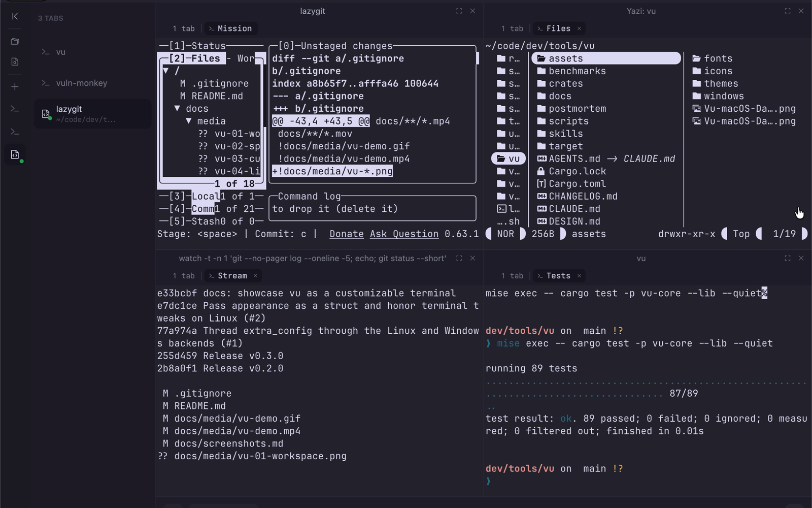
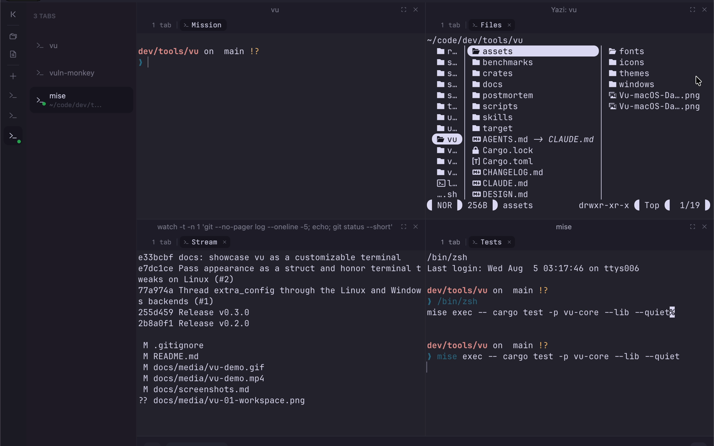
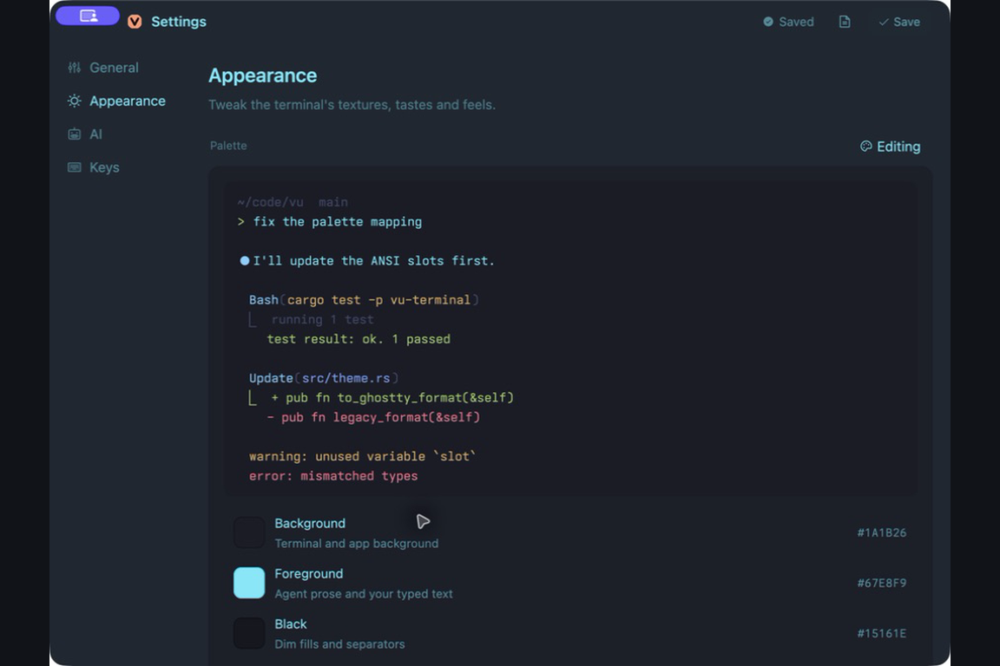
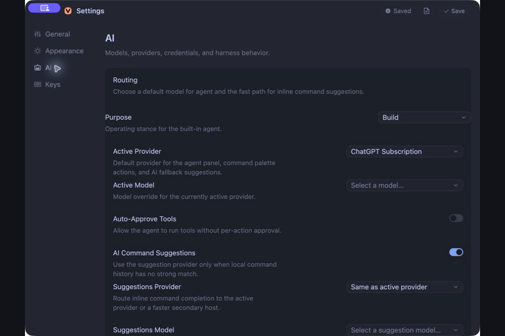
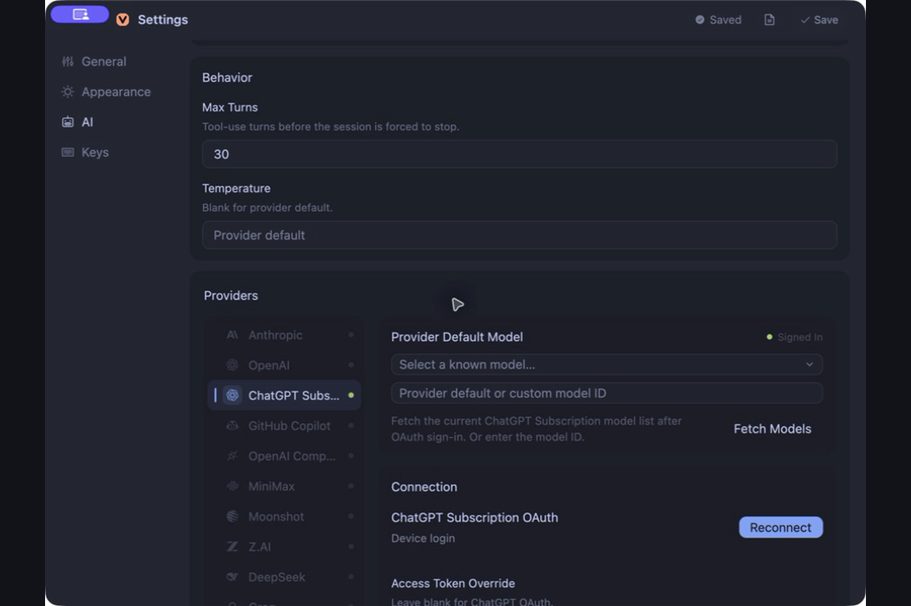

# Screenshots

The README shows one representative view. This page keeps the full gallery in
one place, so the other docs can stay focused.

## Gallery

### Mission Control workspace

### Building the workspace

### Customize

### Live palette editor

### Applied palette

### AI routing and permissions

### AI providers

## Demo

